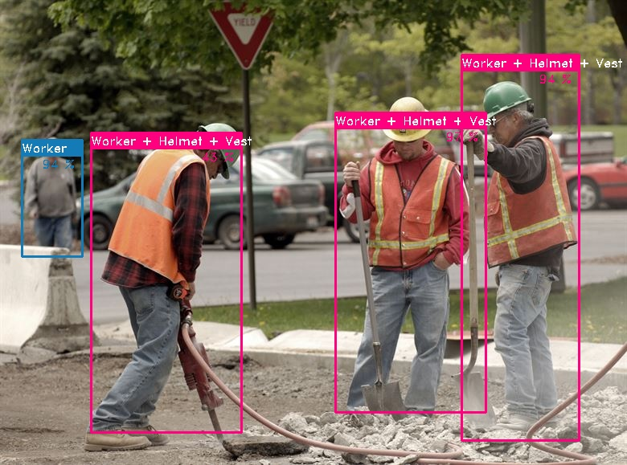

# Kria KV260 Real-Time Personal Protective Equipment Detection
This project is a modified version of samples from [Vitis-AI-Library](https://github.com/Xilinx/Vitis-AI/tree/master/demo/Vitis-AI-Library/samples/yolov3)

## Model
Copy and paste the model to *"/usr/share/vitis_ai_library/models/"*

## Compile
Execute the following command for compilation:

```zsh
sh build.sh
```

## Run 

After compilation to test video execute:

```zsh
./test_video_yolov3 MODEL_NAME 0
```

For jpeg 
```zsh
./test_jpeg_yolov3 MODEL_NAME path/to/image.jpg
```
Where *MODEL_NAME* is the model prefix name. (**yolov3_ppe** in our case)

### Credits
[**Deep Learning for Site Safety: Real-Time Detection of Personal Protective Equipment**](https://www.sciencedirect.com/science/article/pii/S0926580519308325) \
Nipun D. Nath, Amir H. Behzadan, Stephanie G. Paal \
Automation in Construction 112, pp. 103085

[**Xilinx Vitis AI**](https://github.com/Xilinx/Vitis-AI)<br>
Viti-Ai-Library yolov3 samples

### Contributors
<a href="https://github.com/mcedrdiego/Kria_yolov3_ppe/graphs/contributors">
   
</a>

Made with [contrib.rocks](https://contrib.rocks).
